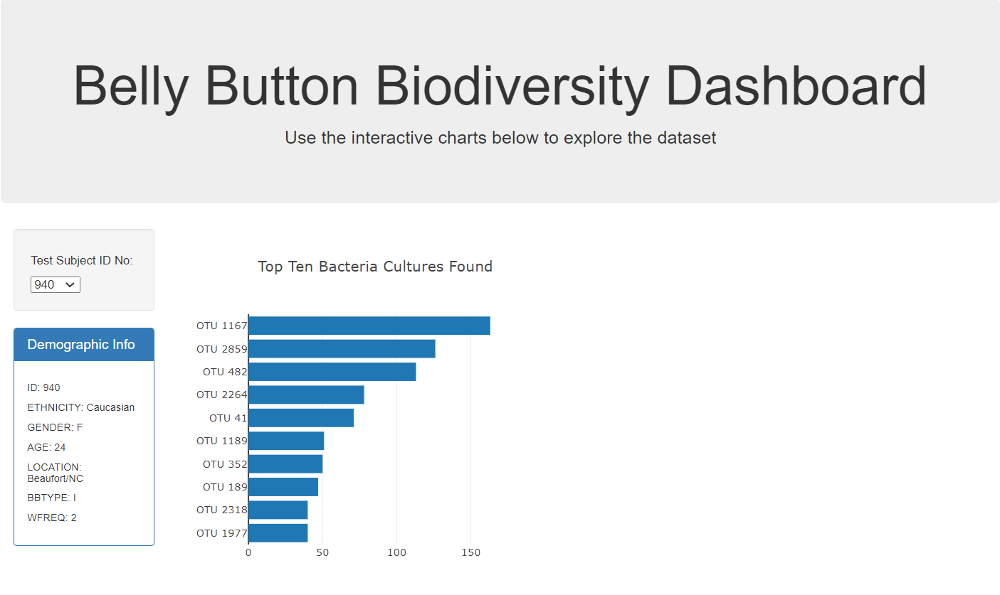
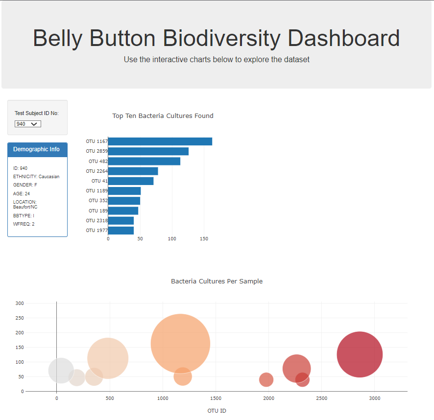
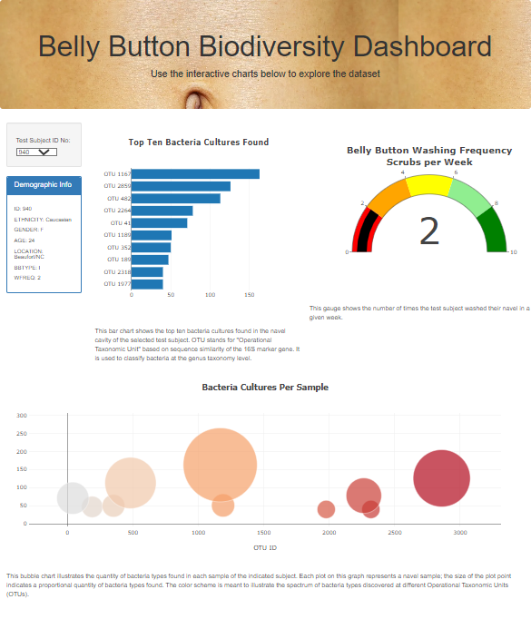

# Belly Button Biodiversity Dashboard
### Overview
The following outlines a dashboard construction project that was undertaken to help a client develop a shareable web-based visualization for bacteria sample data using html, JavaScript, and Plotly.

[View the Belly Button Biodiversity Dashboard here.](https://samsteffen.github.io/Plotly-sample/)

For the project deliverable the client requested a webpage that would host the following data:
1. A Horizontal Bar Chart showing the top ten bacterial samples from a given test subject.
2. A Bubble Chart depicting bacteria cultures per sample from the same given test subject.
3. A guage chart to help illustrate the relationship between number of 'belly button washes' per week and navel bacteria in the test subject's sample.  

### Results
To help Roza complete her visualizations, we first created an html script to hold the visualizations for our webpage ("index.html"). 

We then created a JavaScript file (charts.js) that contains four main functions: ```init()```, ```optionChanged()```, ```buildMetadata()```, and ```buildCharts()```. The charts.js script pulls data from the "samples.json" file and loads the ID numbers of the test subjects as options in a selection panel. The ```init()``` function initializes all of the charts on the page so that the charts appear when the page is loaded by calling the ```buildCharts()``` function; it also presents all the demographic information of the default test subject number by calling the ```buildmetaData()``` function. The ```optionChanged()``` function also calls the ```buildMetadata()``` and ```buildCharts()``` functions, but takes the parameter "newSample" which is generated any time the user selects a different test subject ID from the selection menu.

The charts were created using Plotly and JavaScript. The following images illustrate the outcomes of each:

1. A Horizontal Bar Chart showing the top ten bacterial samples from a given test subject.



2. A Bubble Chart depicting bacteria cultures per sample from the same given test subject.



3. A guage chart to help illustrate the relationship between number of 'belly button washes' per week and navel bacteria in the test subject's sample. 



### Summary
Upon completing the initial index.html and charts.js scripts, we further customized our webpage using the following modifications:
- Added an image to the jumbotron.
- Added a background color to the webpage.
- Added information about what each graph visualizes, beneath each graph.

To view the completed webpage, visit: https://samsteffen.github.io/Plotly-sample/

